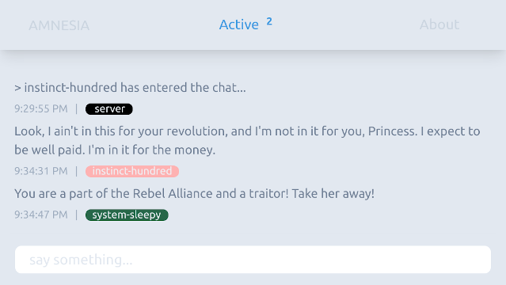

# AMNESIA CHAT

A forgetful chat room with no usernames and no long term memory.

## Description

AMNESIA was put together during the [2020 Covid-19 Lockdown](https://en.wikipedia.org/wiki/COVID-19_pandemic_in_Namibia) as a WebSocket learning exercise and allows anonymous discourse for up to 100 users at a time. Beware, it does not have any abuse protection in place at the moment. Please treat others as you would treat yourself and use your better judgement when speaking to strangers on the internet.

## Getting Started

### Dependencies

* [Tailwind CSS](https://tailwindcss.com/)
* [Node.js](https://nodejs.org/)
* [Express](https://expressjs.com/)
* [Socket.io](https://socket.io/)

## Version History

* 0.0.1
    * Initial Deployment, Hello World!

## Roadmap

Some short term goals to help make AMNESIA more usable.

#### Front End

- [ ] Rework Interface: Minimal, Clean, Responsive
- [ ] Multi-Room Landing: `EVENTS | AREAS | CONCERNS | INTERESTS`
- [ ] Text Fade: Chat messages slowly disappear
- [ ] Moderator Overlay: Heatmaps and Session IDs, Timestamps
- [ ] Dark Mode

#### General Chat Commands

- [ ] Colour Codes: change text to predetermined colour -- `!CHAT|COLOURCODE`
- [ ] Region Codes: enable in-line region code -- `!CHAT|REGION|NAME`
- [ ] ID Codes: enable random user id for session -- `!CHAT|ID|STATE`

#### Abuse Mitigation

- [ ] Auto Ban by IP
- [ ] Auto Rate Limit by IP
- [ ] Ban Timers
- [ ] Ban Redirect

#### Moderation Tools

- [ ] Moderator Tokens: elevates user to moderator -- `!SECRETTOKEN|COMMANDS`
- [ ] Global Rate-Limiting: slows down global chat -- `!SECRETTOKEN|SLOW|RATE`
- [ ] Manual Ban: targets an offending user directly -- `!SECRETTOKEN|BAN|SESSIONID|TIME|REASON`

## License

This project is licensed under the MIT License - see the LICENSE.md file for details