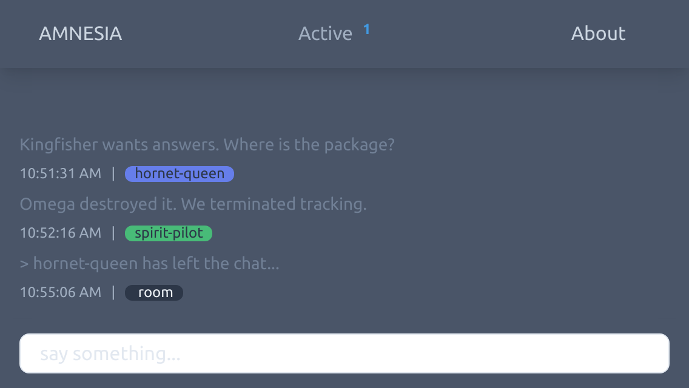

# AMNESIA CHAT

A forgetful chat room with no usernames and no long term memory.

## Description

AMNESIA was put together during the [2020 Covid-19 Lockdown](https://en.wikipedia.org/wiki/COVID-19_pandemic_in_Namibia) as a WebSocket learning exercise and allows anonymous discourse. Beware, it does not have any abuse protection in place at the moment.

## Getting Started

### Dependencies

* [Tailwind CSS](https://tailwindcss.com/)
* [Node.js](https://nodejs.org/)
* [Express](https://expressjs.com/)
* [Socket.io](https://socket.io/)

## Version History

* 0.0.1
    * Initial Deployment, Hello World!

## Roadmap

Some short term goals to help make AMNESIA more usable.

#### Front End

- [ ] Rework Interface: Minimal, Clean, Responsive
- [ ] Multi-Room Landing: `EVENTS | AREAS | INTERESTS`
- [ ] Text Fade: Chat messages slowly disappear
- [ ] Moderator Overlay: Heatmaps and Session IDs

#### General Chat Commands

- [ ] Colour Codes: change text to predetermined colour -- `!CHAT|TEXT|COLOUR`
- [ ] Region Codes: enable in-line region code -- `!CHAT|REGION|NAME`
- [ ] ID Codes: enable random user id for session -- `!CHAT|ID|STATE`

#### Abuse Mitigation

- [ ] Auto Ban by IP
- [ ] Ban Cooldown Timers

#### Service

- [ ] Room User Limit
- [ ] Room Full Redirect
- [ ] Ban Redirect

#### Moderation Tools

- [ ] Moderator Tokens: elevates user to moderator -- `!SECRETTOKEN|COMMANDS`
- [ ] Global Rate-Limiting: slows down global chat -- `!SECRETTOKEN|SLOW|RATE`
- [ ] Manual Ban: targets an offending user directly -- `!SECRETTOKEN|BAN|SESSIONID|TIME|REASON`

## License

This project is licensed under the MIT License - see the LICENSE.md file for details